Check out the configuration reference at https://huggingface.co/docs/hub/spaces-config-reference


# ACRES RAG Project

## Architecture

The ACRES RAG system follows a modular architecture designed for efficient document processing and information extraction:

```mermaid
%%{init: {'theme': 'default', 'themeVariables': { 'fontSize': '16px' }, 'flowchart': { 'htmlLabels': true, 'curve': 'basis', 'width': '100%', 'height': '100%' }}}%%
graph LR
    %% User Interaction Layer
    User((User)) --> WebUI[Web UI\nGradio Interface]
    User --> API[FastAPI\nREST API]
    
    subgraph "Input Stage"
        WebUI
        API
        subgraph "Input Sources"
            ZoteroLib[Zotero Library]
            PDFUpload[PDF Upload]
        end
        WebUI --> ZoteroLib
        WebUI --> PDFUpload
        API --> ZoteroLib
        API --> PDFUpload
    end

    subgraph "Processing Core"
        subgraph "Document Ingestion"
            ZoteroManager[Zotero Manager\nCollection & Items]
            PDFProcessor[PDF Processor\nFile Management]
            ZoteroLib --> ZoteroManager
            PDFUpload --> PDFProcessor
        end

        subgraph "Document Processing"
            TextExtraction[Text Extraction\n& Preprocessing]
            ChromaDB[(ChromaDB\nVector Store)]
            ZoteroManager --> TextExtraction
            PDFProcessor --> TextExtraction
            TextExtraction --> ChromaDB
        end

        subgraph "RAG Pipeline"
            QueryProcessing[Query Processing]
            Retrieval[Document Retrieval]
            LLMInference[LLM Inference\nOpenAI]
            
            ChromaDB --> Retrieval
            QueryProcessing --> Retrieval
            Retrieval --> LLMInference
        end

        subgraph "Variable Extraction"
            VariableParser[Variable Parser]
            DataFrameGen[DataFrame Generation]
            LLMInference --> VariableParser
            VariableParser --> DataFrameGen
        end
    end

    subgraph "Output Stage"
        CSVExport[CSV Export]
        DataFrameView[DataFrame View]
        DataFrameGen --> CSVExport
        DataFrameGen --> DataFrameView
    end

    CSVExport --> ACRESTeam[ACRES Team]
    DataFrameView --> ACRESTeam[ACRES Team]

    %% Styling
    classDef primary fill:#f9f,stroke:#333,stroke-width:4px
    classDef secondary fill:#bbf,stroke:#333,stroke-width:3px
    classDef storage fill:#dfd,stroke:#333,stroke-width:3px
    
    class WebUI,API primary
    class ZoteroManager,PDFProcessor,TextExtraction,QueryProcessing,Retrieval,LLMInference,VariableParser,DataFrameGen secondary
    class ChromaDB storage
```



### Architecture Components

1. **Input Stage**
   - Web UI: Gradio-based interface for user interactions
   - REST API: FastAPI endpoints for programmatic access
   - Input Sources: Supports both Zotero library integration and direct PDF uploads

2. **Processing Core**
   - Document Ingestion: Handles document collection from various sources
   - Document Processing: Extracts and preprocesses text from documents
   - RAG Pipeline: Implements retrieval-augmented generation for accurate information extraction
   - Variable Extraction: Parses and structures extracted information

3. **Output Stage**
   - Provides structured data in CSV format
   - Offers interactive DataFrame views
   - Delivers processed data to ACRES team for analysis

## Project Setup

To test and run the project locally. Clone the project from github and change directoory to `acres`.

```sh
git clone https://github.com/SunbirdAI/acres.git
cd acres
```

Create python virtual environment and activate it.

```sh
python -m venv env
source env/bin/activate
```

Install project dependencies

```sh
pip install -r requirements.txt
```

## Run project locally
To test the project locally follow the steps below.

Copy `.env.example` to `.env` and provide the correct enviroment variable values.

```sh
cp .env.example .env
```

Run the application

```sh
python app.py
```

OR

```sh
gradio app.py
```

Browse the application with the link `http://localhost:7860/`

### Run the api
Make sure the gradio app is running on port `7860` and then run the command below in another terminal tab in the same directory.

```sh
uvicorn api:app --reload
```

Browse the api at `http://localhost:8000/docs`


## Run with docker
To run the application with docker locally, first make sure you have docker installed. See [link](https://docs.docker.com/)

Build the project docker image

```sh
docker build -f Dockerfile.gradio -t gradio-app .
```

Create docker network

```sh
docker network create gradio-fastapi-network
```

Run the docker container 

```sh
docker run -it -p 7860:7860 --rm --name gradio --network=gradio-fastapi-network gradio-app
```

Browse the application with the link `http://localhost:7860/`

To run the api with docker run the commands below. The gradio container should be run first before running the api.

```sh
docker build -f Dockerfile.api -t fastapi-app .
docker run -it -p 8000:8000 --rm --name fastapi --network=gradio-fastapi-network fastapi-app
```

Browse the api at `http://localhost:8000/docs`


## Deploy to AWS ECS (Elastic Container Service) with Fargate

Install and configure the AWS CLI and aws credentials. See [link](https://docs.aws.amazon.com/cli/latest/userguide/cli-chap-welcome.html)

OR: See the pdf document [here](https://docs.aws.amazon.com/pdfs/cli/latest/userguide/aws-cli.pdf#getting-started-quickstart)

Now follow the steps below to deploy to AWS ECS

Setup the default region and your aws account id

```sh
export AWS_DEFAULT_REGION=region # i.e us-east-1, eu-west-1
export AWS_ACCOUNT_ID=aws_account_id # ie. 2243838xxxxxx
```

Login into the AWS ECR (Elastic Container Registry) via the commandline

```sh
aws ecr get-login-password --region $AWS_DEFAULT_REGION | docker login --username AWS --password-stdin "$AWS_ACCOUNT_ID.dkr.ecr.$AWS_DEFAULT_REGION.amazonaws.com"
```

Create a python image and push to ECR. This image will be used as the base image for the application image deployed on AWS ECS.

- Create python repository

```sh
aws ecr create-repository \
  --repository-name gradio-python \
  --image-tag-mutability MUTABLE
```

```sh
export ECR_PYTHON_URL="$AWS_ACCOUNT_ID.dkr.ecr.$AWS_DEFAULT_REGION.amazonaws.com/gradio-python"
echo $ECR_PYTHON_URL
```

- Pull python image and tag it to the ECR url

```sh
docker pull python:3.11.10-slim
docker tag python:3.11.10-slim $ECR_PYTHON_URL:3.11.10-slim

docker push $ECR_PYTHON_URL:3.11.10-slim
```

- Now create application repostory

```sh
aws ecr create-repository \
  --repository-name gradio-app-prod \
  --image-tag-mutability MUTABLE

export ECR_BACKEND_GRADIO_URL="$AWS_ACCOUNT_ID.dkr.ecr.$AWS_DEFAULT_REGION.amazonaws.com/gradio-app-prod"
echo $ECR_BACKEND_GRADIO_URL
```

- Build the docker image for the production and push to ECR

```sh
docker build --build-arg AWS_ACCOUNT_ID=$AWS_ACCOUNT_ID -f Dockerfile.gradio.prod -t gradio-app-prod .
docker tag gradio-app-prod:latest "${ECR_BACKEND_GRADIO_URL}:latest"
docker push "${ECR_BACKEND_GRADIO_URL}:latest"
```

- Now create fastapi repostory

```sh
aws ecr create-repository \
  --repository-name fastapi-api-prod \
  --image-tag-mutability MUTABLE

export ECR_BACKEND_FASTAPI_URL="$AWS_ACCOUNT_ID.dkr.ecr.$AWS_DEFAULT_REGION.amazonaws.com/fastapi-api-prod"
echo $ECR_BACKEND_FASTAPI_URL
```

- Build the docker image for the production and push to ECR

```sh
docker build --build-arg AWS_ACCOUNT_ID=$AWS_ACCOUNT_ID -f Dockerfile.api.prod -t fastapi-api-prod .
docker tag fastapi-api-prod:latest "${ECR_BACKEND_FASTAPI_URL}:latest"
docker push "${ECR_BACKEND_FASTAPI_URL}:latest"
```

### Setup and Provision AWS ECS infra using AWS Cloudformation (IaC)

#### Install
To install the CFN-CLI run the command below

```sh
pip install cloudformation-cli cloudformation-cli-java-plugin cloudformation-cli-go-plugin cloudformation-cli-python-plugin cloudformation-cli-typescript-plugin
```

#### CFN-Toml

```sh
gem install cfn-toml
```


Copy `infra/ecs_config.template` to `infra/ecs_config.toml` and provide the correct `AWS Account ID` for the `ContainerImageGradio`

```sh
cp infra/ecs_config.template infra/ecs_config.toml
```


#### Deploy

To deploy the ECS infra run the commands below. It provisions the cloudformation stack changeset for review. 

Log into your aws console and search for `cloudformation`. See and review the changeset. If everything is good execute the changeset to finish with the infra deployment.

Then look for the outputs to the link for the deployed application.

```sh
chmod u+x bin/cfn/*
./bin/cfn/ecs-deploy
```

#### Update Task Definition Deployments
After making changes, build the docker images and then push to ECR.

To update the task definition deployments, force the new deployment by running the commands below

For the gradio task definition

```sh
./bin/cfn/ecs-deploy-update-gradio
```

For the api task definition

```sh
./bin/cfn/ecs-deploy-update-api
```

